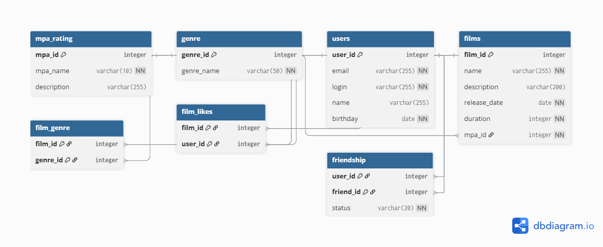

# Filmorate

Бэкенд для сервиса, который работает с фильмами и оценками пользователей, а также возвращает топ фильмов, рекомендованных к просмотру.

## Схема базы данных



## Описание таблиц

### Основные таблицы

**users** — пользователи приложения
- `user_id` — первичный ключ, автоинкремент
- `email` — электронная почта (уникальная)
- `login` — логин пользователя (уникальный)
- `name` — имя для отображения
- `birthday` — дата рождения

**films** — фильмы
- `film_id` — первичный ключ, автоинкремент
- `name` — название фильма
- `description` — описание (макс. 200 символов)
- `release_date` — дата релиза
- `duration` — продолжительность в минутах
- `mpa_id` — внешний ключ на рейтинг MPA

**mpa_rating** — справочник рейтингов MPA
- `mpa_id` — первичный ключ
- `mpa_name` — название рейтинга (G, PG, PG-13, R, NC-17)
- `description` — описание возрастного ограничения

**genre** — справочник жанров
- `genre_id` — первичный ключ
- `genre_name` — название жанра

### Связующие таблицы

**film_genre** — связь фильмов с жанрами (многие-ко-многим)
- `film_id` — внешний ключ на фильм
- `genre_id` — внешний ключ на жанр
- Составной первичный ключ (film_id, genre_id)

**film_likes** — лайки фильмов пользователями (многие-ко-многим)
- `film_id` — внешний ключ на фильм
- `user_id` — внешний ключ на пользователя
- Составной первичный ключ (film_id, user_id)

**friendship** — дружеские связи между пользователями
- `user_id` — внешний ключ на пользователя
- `friend_id` — внешний ключ на друга
- `status` — статус дружбы (CONFIRMED, UNCONFIRMED)
- Составной первичный ключ (user_id, friend_id)

## Примеры SQL-запросов

### Получить все фильмы
```sql
SELECT f.*, m.mpa_name 
FROM films f
JOIN mpa_rating m ON f.mpa_id = m.mpa_id;
```

### Получить фильм по ID с жанрами и рейтингом
```sql
SELECT f.film_id,
       f.name,
       f.description,
       f.release_date,
       f.duration,
       m.mpa_id,
       m.mpa_name,
       g.genre_id,
       g.genre_name
FROM films f
LEFT JOIN mpa_rating m ON f.mpa_id = m.mpa_id
LEFT JOIN film_genre fg ON f.film_id = fg.film_id
LEFT JOIN genre g ON fg.genre_id = g.genre_id
WHERE f.film_id = 1;
```

### Получить топ-10 самых популярных фильмов (по количеству лайков)
```sql
SELECT f.film_id,
       f.name,
       f.description,
       f.release_date,
       f.duration,
       m.mpa_name,
       COUNT(fl.user_id) AS likes_count
FROM films f
LEFT JOIN mpa_rating m ON f.mpa_id = m.mpa_id
LEFT JOIN film_likes fl ON f.film_id = fl.film_id
GROUP BY f.film_id, f.name, f.description, f.release_date, f.duration, m.mpa_name
ORDER BY likes_count DESC
LIMIT 10;
```

### Получить всех пользователей
```sql
SELECT user_id,
       email,
       login,
       name,
       birthday
FROM users;
```

### Получить пользователя по ID
```sql
SELECT user_id,
       email,
       login,
       name,
       birthday
FROM users
WHERE user_id = 1;
```

### Получить всех друзей пользователя
```sql
SELECT u.user_id,
       u.email,
       u.login,
       u.name,
       u.birthday
FROM users u
JOIN friendship f ON u.user_id = f.friend_id
WHERE f.user_id = 1;
```

### Получить общих друзей двух пользователей
```sql
SELECT u.user_id,
       u.email,
       u.login,
       u.name,
       u.birthday
FROM users u
WHERE u.user_id IN (
    SELECT friend_id
    FROM friendship
    WHERE user_id = 1
    INTERSECT
    SELECT friend_id
    FROM friendship
    WHERE user_id = 2
);
```

### Добавить новый фильм
```sql
INSERT INTO films (name, description, release_date, duration, mpa_id)
VALUES ('Inception', 'A mind-bending thriller', '2010-07-16', 148, 3)
RETURNING film_id;
```

### Добавить жанры к фильму
```sql
INSERT INTO film_genre (film_id, genre_id)
VALUES (1, 4), -- Триллер
       (1, 6); -- Боевик
```

### Добавить лайк фильму
```sql
INSERT INTO film_likes (film_id, user_id)
VALUES (1, 1);
```

### Удалить лайк у фильма
```sql
DELETE FROM film_likes
WHERE film_id = 1 AND user_id = 1;
```

### Добавить нового пользователя
```sql
INSERT INTO users (email, login, name, birthday)
VALUES ('user@example.com', 'userlogin', 'User Name', '1990-01-01')
RETURNING user_id;
```

### Добавить друга (неподтверждённая дружба)
```sql
INSERT INTO friendship (user_id, friend_id, status)
VALUES (1, 2, 'UNCONFIRMED');
```

### Подтвердить дружбу (сделать взаимной)
```sql
UPDATE friendship
SET status = 'CONFIRMED'
WHERE (user_id = 1 AND friend_id = 2)
   OR (user_id = 2 AND friend_id = 1);
```

### Удалить друга
```sql
DELETE FROM friendship
WHERE (user_id = 1 AND friend_id = 2)
   OR (user_id = 2 AND friend_id = 1);
```

### Получить все жанры фильма
```sql
SELECT g.genre_id,
       g.genre_name
FROM genre g
JOIN film_genre fg ON g.genre_id = fg.genre_id
WHERE fg.film_id = 1
ORDER BY g.genre_id;
```

### Получить количество лайков у фильма
```sql
SELECT COUNT(user_id) AS likes_count
FROM film_likes
WHERE film_id = 1;
```

## Технологии

- Java 21
- Spring Boot
- PostgreSQL
- Lombok
- Maven